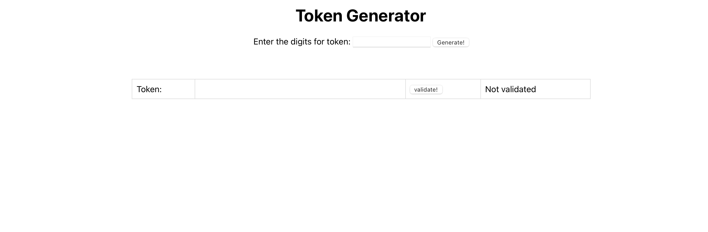
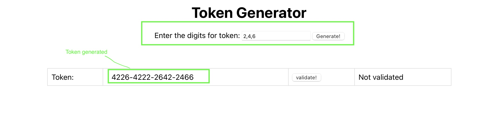
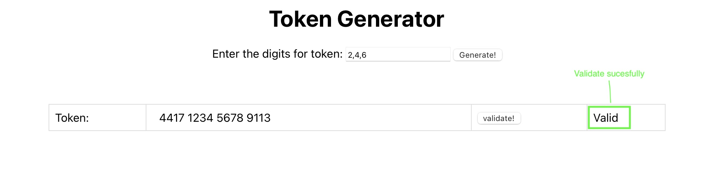

# Token Generator
Token generator is package of spring-boot and reactJs app which can generate 16 digit token and validate any token that is passed using Luhn formula.

Project can be setup in your local using either via `Bash` or `Docker`.
## Project Setup using Bash - Prerequisites :bulb:

    Java 17
    Maven
    Node
    ReactJs

## Project Setup using Docker - Prerequisites :bulb:

    Docker
    Docker compose
    
### **Start the app using bash** :roller_coaster:
> - Check out the code. cd `token-generator` parent folder.
> - If no permision to execute the start-app.sh, execute the command `chmod +x start-app.sh` (This is for MacOS and Linux)
> - execute the command: `sh start-app.sh` for windows `./start-app.sh`

### **Start the app using Docker** :bicyclist:
> - To start the containers, execute the command `docker-compose up -d`. Please note that there is a compatibility issue with MacOS M1 chipset for the base image "/openjdk:17-jdk-alpine" used for the back-end app. It should work seamlessly on Linux and Windows systems.

<table>
  <tbody style="border:none">
    <tr>
      <td></td>
    </tr>
    <tr>
      <td></td>
    </tr>
    <tr>
      <td></td>
    </tr>
  </tbody>
</table>
          
## Contributors :computer:

<!-- ALL-CONTRIBUTORS-LIST:START - Do not remove or modify this section -->
<!-- prettier-ignore-start -->
<!-- markdownlint-disable -->
<table>
  <tbody style="border:none">
    <tr>
      <td align="center">
      <a target="_blank" href="">
      
       
      <b></b>
      </a>
       Jithin
       <a href="https://www.linkedin.com/in/jithingopi/">LinkedIn</a>
      </td>
 </tr>
  </tbody>
</table>

### Quick References
> Luhn Algorithm - https://en.wikipedia.org/wiki/Luhn_algorithm
